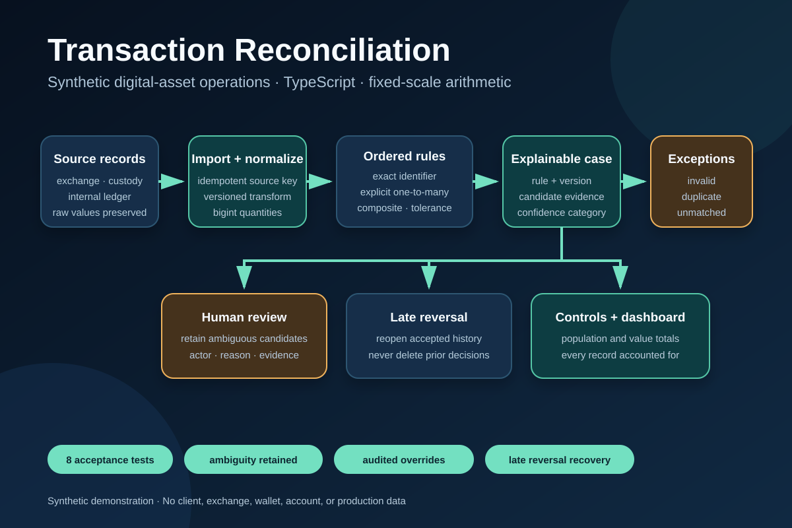
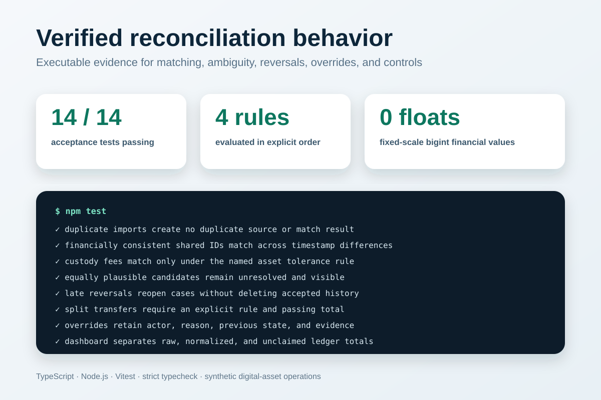

# Transaction reconciliation

**Status:** implemented synthetic demonstration.

A synthetic digital-asset operations system that reconciles exchange executions, custody movements, and an internal transaction ledger without using any real client, exchange, wallet, or third-party data.





PNG exports for proposals and interview screen sharing: [architecture](portfolio/architecture.png) and [verified results](portfolio/verified-results.png).

## Scenario

An operations team receives trades and transfers from multiple synthetic sources. Identifiers do not always align, timestamps and fees differ, transfers may be split into ledger parts, reversals arrive after reconciliation, and duplicate exports are common. Operators need deterministic automation without losing the evidence behind each decision.

## Demonstrated outcome

- Ingest versioned API-shaped records with source provenance and preserved raw values.
- Normalize assets, quantities, fees, and explicitly offset RFC 3339 timestamps.
- Apply exact rules before explicitly ordered tolerance and composite rules.
- Require shared identifiers to agree on domain, quantity, and fee, and reserve ledger evidence to one accepted case.
- Keep ambiguous candidates unresolved rather than selecting the closest record silently.
- Explain every case with a named rule, rule version, evidence IDs, and confidence category.
- Keep unmatched source events and ambiguous candidates as cases; route invalid, identical-duplicate, and conflicting-key imports to exceptions; record reversals in audit history.
- Record validated manual resolutions as append-only audit events and preserve them across reruns.
- Produce population counts, fixed-scale quantity/fee totals by asset and source, and explicit unmatched-ledger coverage.

## Synthetic data model

```text
source_record
  → normalized_event
  → match_candidate
  → reconciliation_case
  → resolution_event
  → control_total
```

Every derived record retains stable links to its raw source and transformation version.

## Acceptance scenarios

1. An identical re-import creates no duplicate source or match result.
2. A trade matches by shared identifier despite timestamp differences when its financial fields agree.
3. A shared identifier with conflicting financial fields remains unresolved.
4. One ledger event cannot be accepted by two source cases.
5. A custody fee within configured asset precision matches under a named tolerance rule.
6. Two equally plausible candidates create one ambiguous case and no automatic match.
7. A late reversal reopens the affected case and remains reopened across reruns.
8. A split transfer matches one-to-many only when its explicit aggregation rule and control total pass.
9. A manual resolution records its actor, reason, transition, and evidence and survives reruns.
10. Dashboard ledger coverage lists every normalized, non-reversal ledger event that remains unclaimed.
11. Timestamps require deterministic RFC 3339 parsing with an explicit offset.
12. A corrected record can replace an invalid import, while changed reuse of an accepted key is rejected as a conflict.
13. Manual evidence must be non-reversal ledger data in the case domain and not claimed elsewhere.
14. Dashboard populations and per-asset control totals distinguish raw imports from normalized records.

## Implemented stack

TypeScript, Node.js, Vitest, strict compiler checks, deterministic synthetic fixtures, and an in-memory store that keeps the matching and audit behavior executable without external credentials or infrastructure. A production implementation would replace the store with PostgreSQL, add durable job processing, and expose operator workflows through an authenticated interface.

The engine uses fixed-scale `bigint` arithmetic rather than floating-point values for quantities and fees.

## Implemented behavior

- Idempotent import keyed by source and source record ID.
- Corrected recovery for invalid imports and explicit conflict rejection for accepted keys.
- Versioned normalization with preserved links to raw records.
- Deterministic parsing of explicitly offset RFC 3339 timestamps.
- Ordered financially consistent exact-identifier, explicit aggregation, exact-composite, and named tolerance rules.
- Exclusive ownership of accepted ledger evidence.
- Ambiguous-candidate preservation instead of silent closest-match selection.
- Explicit one-to-many matching only under a configured aggregation rule and passing control total.
- Late-reversal reopening without deleting accepted history.
- Manual resolution with actor, reason, previous status, new status, selected evidence validation, and rerun preservation.
- Source-and-asset control totals, dashboard population counts, and unmatched-ledger coverage.
- Invalid, identical-duplicate, and conflicting accepted-key inputs routed to exception records.

## Repository shape

```text
src/decimal.ts    fixed-scale decimal parsing and arithmetic
src/types.ts      source, normalized, case, audit, and reporting contracts
src/store.ts      in-memory persistence and append-only audit recording
src/engine.ts     import, normalization, ordered matching, reversal, and override logic
src/demo.ts       executable structured-output walkthrough
test/             fourteen acceptance tests
```

## Run it

```bash
npm ci
npm run verify
```

Verified on 2026-08-29: fourteen tests passed, the TypeScript compiler check passed, and the structured-output demo completed.

## Portfolio evidence

- Executable ordered matching and audit engine.
- Deterministic synthetic fixtures and boundary-focused tests.
- Duplicate, invalid-input, ambiguous-match, late-reversal, split-transfer, and manual-override scenarios.
- Structured case, audit, exception, dashboard, and control-total output.
- Documented limitations and production scaling path.

## Non-goals

No real customer, exchange, blockchain, wallet, account, tax lot, pricing feed, or regulated reporting data. The demo does not provide accounting, investment, audit, tax, custody, or regulatory advice.

## Provenance

Artifact owner: Lars Schouw. Repository account: [`damian123`](https://github.com/damian123). Commits may use the display name Damian; `EVIDENCE.json` records this mapping explicitly.
